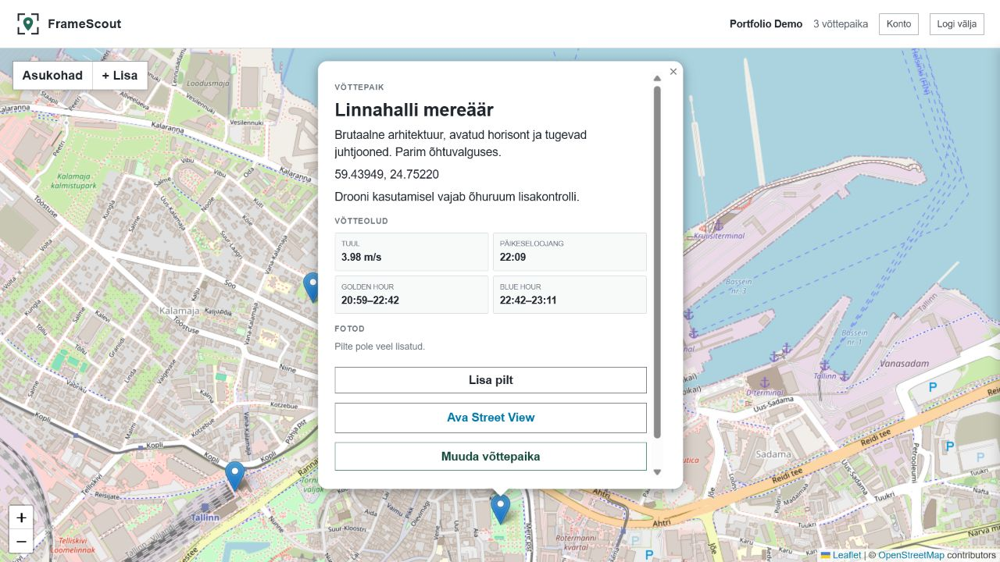
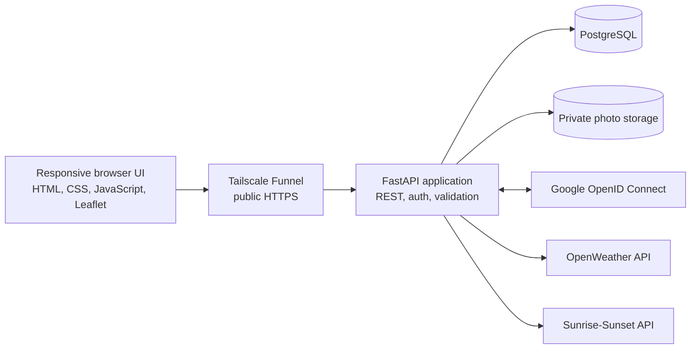

<p align="center">
  
</p>

<h1 align="center">FrameScout</h1>

<p align="center">
  A full-stack location scouting tool for filmmakers and small production teams.
</p>

<p align="center">
  <code>FastAPI</code>
  · <code>PostgreSQL</code>
  · <code>SQLAlchemy</code>
  · <code>Leaflet</code>
  · <code>Google OpenID Connect</code>
  · <code>Raspberry Pi</code>
</p>

## Why FrameScout?

Film locations are often scattered across map bookmarks, phone photos and
personal notes. FrameScout brings those details into one workspace: a user can
mark a location on a map, document production considerations, attach reference
photos and check current wind and useful natural-light windows.

This is a production-minded portfolio project. It covers the complete lifecycle
of a web application: relational data modelling, authenticated REST APIs,
third-party integrations, responsive frontend work, privacy controls and
self-hosted deployment.

## Application preview



## Main features

- Interactive Leaflet map with an intentional location placement mode
- Create, list, edit and delete scouting locations
- Production notes and optional drone airspace reminders
- Current wind data from OpenWeather
- Sunrise, sunset, golden-hour and blue-hour windows
- Reference photo gallery with an in-page lightbox
- JPEG, PNG, WebP, HEIC and MPO upload support
- Automatic image normalization, orientation correction and EXIF removal
- Email/password accounts with Argon2 password hashing
- Optional Google OpenID Connect login
- Per-user ownership checks for locations, photos and conditions
- Personal ZIP export containing structured JSON and uploaded photos
- Account and associated data deletion
- Responsive desktop and mobile interface
- Privacy notice and terms of use
- Raspberry Pi deployment with PostgreSQL, systemd and Tailscale Funnel HTTPS

## Architecture



The browser never talks directly to PostgreSQL or exposes API secrets. FastAPI
acts as the boundary between the user interface, stored data and external
services.

For a deeper explanation of the design decisions, see
[Technical overview](docs/technical-overview.md).

## Technical highlights

### Ownership is enforced in the backend

Every protected query includes both the resource ID and authenticated user ID.
A user receives `404 Not Found` for another user's location instead of learning
whether that resource exists.

### External data is fetched concurrently

The combined flight-conditions endpoint requests wind and sun data
asynchronously. Wind is treated as optional, so a missing API key or temporary
OpenWeather outage does not make the rest of a location unusable.

### Photos are treated as untrusted input

Uploads are limited by file size and pixel count, decoded with Pillow,
orientation-corrected, re-encoded into a known format and stripped of EXIF
metadata. Phone HEIC images and MPO files are converted into browser-friendly
JPEGs.

### Database and filesystem changes are coordinated

Deleting a location or account affects both PostgreSQL and the photo directory.
Photo folders are first moved to a temporary path, restored if the database
transaction fails, and removed only after a successful commit.

### Authentication uses secure browser cookies

Passwords are stored as Argon2 hashes. Successful login creates a short-lived
JWT in an `HttpOnly`, `SameSite=Lax` cookie; production HTTPS additionally uses
the `Secure` flag. Google login follows the OpenID Connect authorization flow.

## Project structure

```text
app/
├── main.py                 # FastAPI routes and application orchestration
├── database.py             # PostgreSQL engine and request-scoped sessions
├── models.py               # SQLAlchemy database models
├── schemas.py              # Pydantic request and response validation
├── security.py             # Password hashing and JWT handling
├── oauth.py                # Google OpenID Connect configuration
├── services/
│   ├── weather.py          # OpenWeather integration
│   └── sun.py              # Sunrise-Sunset integration
└── templates/              # Privacy and terms pages

database/
├── schema.sql              # Initial PostgreSQL schema
└── migrations/             # Incremental database changes

frontend/
├── index.html
├── styles.css
├── app.js
└── assets/
```

## Run locally

### Requirements

- Python 3.13 or newer
- PostgreSQL (tested with PostgreSQL 18)
- Git

### 1. Clone and create a virtual environment

```powershell
git clone https://github.com/Lanque/drone_app.git
cd drone_app
python -m venv .venv
.\.venv\Scripts\Activate.ps1
python -m pip install -r requirements.txt
```

Linux and macOS activation:

```bash
source .venv/bin/activate
```

### 2. Create the database

Create a PostgreSQL login named `drone_app` and a database named
`drone_locations`, owned by that login. Run
[`database/schema.sql`](database/schema.sql) inside `drone_locations`.

This can be done through pgAdmin or PostgreSQL command-line tools:

```bash
createuser --pwprompt drone_app
createdb --owner=drone_app drone_locations
psql --dbname=drone_locations --file=database/schema.sql
```

### 3. Configure environment variables

```powershell
Copy-Item .env.example .env
```

Fill in `.env`. At minimum, configure the PostgreSQL values and a long random
`AUTH_SECRET_KEY`. Never commit this file.

Generate a suitable secret:

```powershell
python -c "import secrets; print(secrets.token_urlsafe(48))"
```

OpenWeather and Google login are optional. Without OpenWeather, locations and
sunlight data continue to work.

### 4. Start the application

```powershell
uvicorn app.main:app --reload --host 127.0.0.1 --port 8010
```

Open [http://127.0.0.1:8010](http://127.0.0.1:8010).

## Configuration

| Variable | Required | Purpose |
|---|---:|---|
| `DB_HOST`, `DB_PORT`, `DB_NAME` | Yes | PostgreSQL server and database |
| `DB_USER`, `DB_PASSWORD` | Yes | Restricted application login |
| `AUTH_SECRET_KEY` | Yes | Signs authentication tokens |
| `OPENWEATHER_API_KEY` | No | Enables current wind data |
| `GOOGLE_CLIENT_ID`, `GOOGLE_CLIENT_SECRET` | No | Enables Google login |
| `OAUTH_SESSION_SECRET` | No | Separate OAuth session secret; falls back to the auth secret |
| `COOKIE_SECURE` | Production | Must be `true` behind public HTTPS |
| `LEGAL_CONTROLLER_NAME`, `LEGAL_CONTACT_EMAIL` | Public deployment | Privacy and terms contact details |

## Verification

Useful checks before deployment:

```powershell
python -m compileall app
node --check frontend/app.js
python -m pip check
git diff --check
```

Runtime health endpoints:

```text
GET /health
GET /health/database
```

## Deployment

The current production-style deployment runs on a Raspberry Pi 5:

- Debian 13
- PostgreSQL 18
- Uvicorn managed by systemd
- Application bound to `127.0.0.1:8010`
- Public HTTPS provided by Tailscale Funnel
- Secrets stored in a server-side `.env` file
- Uploaded photos stored outside Git under `uploads/`

## Current scope and next improvements

FrameScout is a complete portfolio MVP, not a commercial flight-planning
service. Weather and airspace information must always be verified using official
sources.

Natural next steps would be an automated pytest suite and CI workflow, Alembic
migrations, request rate limiting, scheduled encrypted backups and opt-in
shareable scouting boards.

## What this project demonstrates

- Designing a relational model and authenticated CRUD API
- Separating database models, validation schemas and service integrations
- Coordinating asynchronous network calls
- Handling untrusted file uploads safely
- Enforcing authorization server-side
- Building a responsive map-based interface without a heavy frontend framework
- Deploying and debugging a real application on Linux hardware
- Considering privacy, data export and deletion as product features
