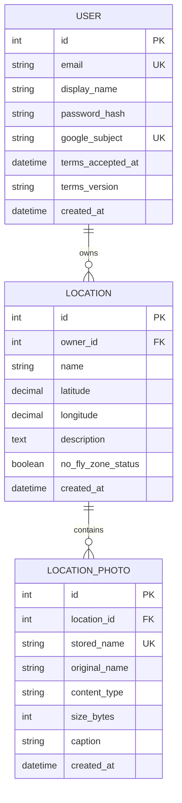

# FrameScout technical overview

This document explains the main engineering decisions behind FrameScout and the
parts of the project that required the most reasoning.

## 1. Application boundaries

FrameScout uses a deliberately small architecture:

1. The browser renders the interface and Leaflet map.
2. FastAPI validates requests, authenticates users and applies business rules.
3. SQLAlchemy maps Python objects to PostgreSQL tables.
4. External service modules retrieve weather and sunlight data.
5. Uploaded image bytes live on the server filesystem; their metadata and
   ownership relationships live in PostgreSQL.

The frontend is served by the same FastAPI application. This removes the need
for cross-origin configuration and lets authentication use same-origin cookies.

## 2. Data model



Coordinates use `DECIMAL(9, 6)` instead of binary floating point in PostgreSQL.
Six decimal places provide sub-metre theoretical precision while keeping the
stored representation predictable.

Foreign keys use `ON DELETE CASCADE`, so deleting a user removes their database
locations and photo records. Filesystem cleanup is coordinated separately
because PostgreSQL cannot delete files from the application directory.

## 3. Request validation and ORM models

SQLAlchemy models describe how data is stored. Pydantic schemas describe what an
API consumer may send or receive.

Keeping these roles separate prevents database-only fields such as `owner_id`
from being accepted directly from the browser. FastAPI creates that value from
the authenticated user instead.

`LocationUpdate.model_dump(exclude_unset=True)` is used for PATCH requests. It
returns only fields actually included by the client, allowing a partial update
without overwriting omitted values.

## 4. Authentication and authorization

### Password accounts

Passwords are hashed with the recommended Argon2 configuration from `pwdlib`.
The original password is never stored.

After a successful login, the backend creates a one-hour JWT containing the user
ID. It is placed in a cookie with:

- `HttpOnly`, preventing normal JavaScript access;
- `SameSite=Lax`, reducing cross-site request risk;
- `Secure` in the HTTPS deployment.

### Google login

Authlib implements the Google OpenID Connect authorization-code flow. The
callback requires a verified email and links the Google subject identifier to a
local user.

### Resource ownership

Authentication answers “who is making this request?” Authorization answers
“may this user access this object?”

`get_owned_location` queries using both `Location.id` and `Location.owner_id`.
Photo, weather, sunlight, edit and delete endpoints reuse this check. Returning
`404` for a foreign resource avoids exposing whether another user's ID exists.

## 5. Enriching stored locations

The database stores stable user content. Wind and sunlight are time-sensitive,
so they are fetched when a location is opened.

The combined endpoint uses `asyncio.gather` to request both services
concurrently:

```text
location request
├── PostgreSQL ownership lookup
├── OpenWeather request
└── Sunrise-Sunset request
```

Sunlight information is required for the combined response. Weather is allowed
to fail gracefully because OpenWeather requires an optional API key. The
frontend can therefore show light information and a “wind unavailable” state
instead of failing the entire popup.

Service modules translate network errors and unexpected response structures
into application-specific exceptions. API routes then convert those exceptions
into controlled HTTP responses.

## 6. Secure image pipeline

An uploaded filename or browser MIME type cannot be trusted. A file named
`photo.jpeg` may contain a different format.

The backend therefore:

1. reads at most 10 MB plus one byte;
2. lets Pillow identify the file contents;
3. accepts only JPEG, PNG, WebP, HEIC or MPO input;
4. rejects images above 50 megapixels before full decoding;
5. applies EXIF orientation;
6. converts phone formats to browser-friendly output;
7. re-encodes the image instead of storing the original bytes;
8. discards EXIF metadata, including possible device GPS data;
9. generates a random server-side filename.

The database stores the original display name, normalized content type, size and
caption. The browser receives photos only through an authenticated endpoint that
checks location ownership.

## 7. Coordinating PostgreSQL and photo files

A database transaction cannot automatically roll back a filesystem deletion.
Deleting the directory first would risk losing photos if the database commit
failed. Committing first would leave orphaned files if later cleanup failed.

FrameScout uses a staged-delete pattern:

1. Rename the target photo directory to a unique temporary name on the same
   filesystem. This is fast and atomic at the filesystem level.
2. Delete the database object and commit.
3. If the commit fails, roll back and rename the directory to its original name.
4. If the commit succeeds, remove the staged directory.

The same idea is used for individual photo deletion, location deletion and
account deletion.

## 8. Frontend design

The frontend uses plain JavaScript to keep the browser architecture visible:

- Leaflet owns map rendering and markers.
- Fetch calls communicate with REST endpoints.
- DOM elements are created using `textContent`, avoiding HTML injection from
  user-provided names, notes and captions.
- Clicking the map only places a draft marker after the user explicitly enters
  add mode.
- Location lists, edit forms and dialogs adapt into constrained mobile panels.
- Photo thumbnails open an in-page modal viewer rather than navigating away.

This approach avoids framework overhead while still separating the interface
into small functions for authentication, map state, photos and forms.

## 9. Privacy-related engineering

Privacy requirements are implemented as application behaviour:

- essential cookies are documented;
- account terms acceptance is versioned and timestamped;
- photos are stripped of metadata;
- users can export their account as a ZIP containing JSON and photos;
- users can delete their account and associated content;
- legal contact details come from environment variables rather than source code.

Only the server sends coordinates to weather and sunlight providers. Account
details are not included in those requests.

## 10. Raspberry Pi deployment

The deployed application uses:

- a dedicated PostgreSQL database and restricted application role;
- a project virtual environment;
- a systemd service that starts Uvicorn using an absolute executable path;
- an environment file outside Git;
- localhost binding so Uvicorn is not directly exposed to the LAN or internet;
- Tailscale Funnel for the public HTTPS entry point;
- systemd restart and boot persistence.

This deployment exposed practical issues that local development alone does not:
Linux permissions, service startup timing, stale Uvicorn processes, HTTPS cookie
configuration, OAuth redirect URLs and persistent photo storage.

## 11. Deliberate trade-offs

FrameScout is intentionally a focused portfolio MVP:

- Plain JavaScript keeps the learning surface small; a larger product could
  benefit from TypeScript and a component framework.
- SQL migrations are currently maintained as SQL files; Alembic would provide a
  stronger migration history.
- Photos use local Raspberry Pi storage; object storage would be more suitable
  for horizontal scaling.
- JWT sessions expire after one hour and are not currently refreshable.
- Shareable public scouting boards are a possible future feature, not part of
  the current authorization model.

## 12. Recommended next engineering steps

1. Move the isolated API regression checks into a committed pytest suite.
2. Run compile, test and dependency checks through GitHub Actions.
3. Add request rate limiting for login, registration and uploads.
4. Add security response headers and optionally disable public API docs.
5. Schedule encrypted PostgreSQL and photo-directory backups.
6. Adopt Alembic before the next database-model change.

